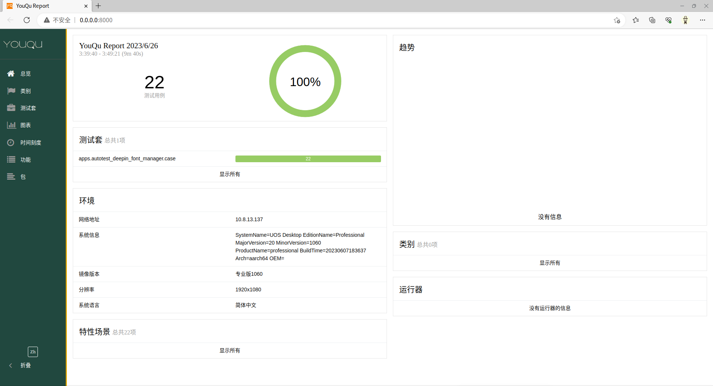

# allure-custom

定制 allure 报告

目前支持的定制项：

1、logo

2、标题栏文案

3、侧边栏颜色

4、默认暂时的语言

---

**Documentation**: <a href="https://funny-test.github.io/allure-custom" target="_blank">https://funny-test.github.io/allure-custom</a>

**Source Code**: <a href="https://github.com/funny-test/allure-custom" target="_blank">https://github.com/funny-test/allure-custom</a>

---

## 安装

```console
pip install allure-custom
---> 100%
```

## 使用方法

```Python
{!../example.py!}
```

## 效果展示

